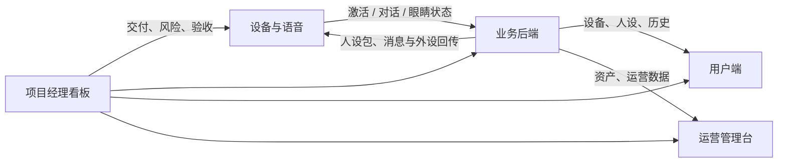
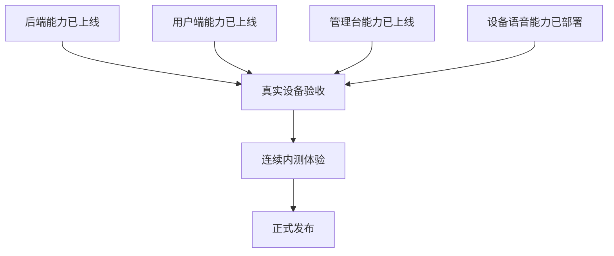
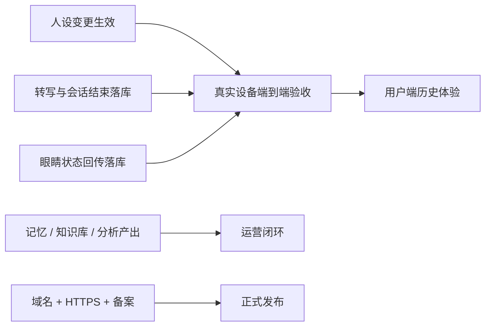

# AI Pet 项目全景与进度（根协作文档）

> **本文档是所有子项目 AI 会话的第一信息源。** 各仓会话开工前先读本文档拉取全局上下文，再读 `AI-Pet协作看板.md`（日常状态流水）和本仓 `AGENTS.md`。
> 本文档记录**经代码核实的真实进度快照**（最近核实：2026-08-19，逐仓核对 Git 状态、近期提交、未提交改动、质量闸与看板部署记录）。
> 日常状态变更仍记 `AI-Pet协作看板.md` / `AI-Pet固件联调看板.md`；当某仓完成阶段性里程碑后，回写本文档对应小节并更新"核实日期"。
> 密钥、密码不进本文档，只记位置。

## 一、体系架构一句话

固件（ESP32）⇄ xiaozhi-server（实时语音/OTA/MCP 路由）⇄ ai-pet-backend（业务真源：用户/设备/persona/记忆/KB）⇄ ai-pet-admin（运营管理台）+ ai-pet-app（用户端 PWA/桌面）。全部署在阿里云 ECS `39.107.143.71`（端口分配见协作看板，唯一真源）。

## 项目经理摘要（2026-08-19）

| 工作流 | 已交付 | 当前状态 | 下一步 / 主要风险 |
|---|---|---|---|
| 用户端 | 主链、主人/宠物拆分、档案、导出、画像、问卷、运势/八字、趣味测试/星盘已实现 | 🟢 `main=7c3d4ed`；本地生产构建通过；最新提交新增“我的”页小记与问卷聚合 | 真实账号继续验收；接入结构化相处关系；最新构建补 ECS 在线版本证据；正式发布仍受 HTTPS 限制 |
| 业务后端 | 核心 API、Memory MCP、Worker、KB、E10、主人/宠物/关系模型、趣味测试/星盘已上线或已实现 | 🟢 `main=1d1a4f3`；ruff/mypy/pytest 130 全绿；ECS 最后明确部署证据为 `ae1ddd8` | 部署并验证 27 类关系目录与宠物口吻修复；E11 仍冻结 |
| 管理台 | 资产、人设、历史、记忆、分析、运势核对、关系、运营指标、KB 运营已实现 | 🟢 `main=c6d4ae4`；本地生产构建通过；最新提交优化 KB 运营页 | 补最新构建在线证据；清理仓内 501 旧文档；继续真实运营数据验收 |
| 设备与语音 | OTA/激活/语音、C5、persona、旁路、Memory MCP、b12 可靠性修复及 b13 五分钟会话窗口已部署 | 🟡 X1 部分通过 | 补齐旁路五类、S1-S5、BIZ 日志和一次真机 `memory.search`；S8 续聊提醒待开发 |
| 固件 | P4 单眼与五个眼睛 MCP 工具；BOX-3B、LCD EV Board 多板型基线 | 🟡 `main=faaae15`；LCD EV Board V1.5 已构建烧录并跑通语音状态，待屏幕/唤醒目视验收 | 先收口 LCD EV Board；P4 仍先解决眼睛资产复现与 OTA 空间，再接第二只眼 |
| 发布运维 | ECS 内测链路可用，Ops 只读采集器骨架已存在 | 🔴 正式发布未就绪 | 域名、ICP、HTTPS/WSS、正式监控告警 |

**当前优先级**：X1 真机收口 > LCD EV Board 屏幕/唤醒验收 > 最新 backend/admin/app 部署证据与 App 结构化关系接入 > E11 主动播报架构拍板 > P4 资产/OTA 与第二只眼 > 域名/TLS/监控。E11 未统一前不得实现 B10/X4/X5/A15/D6/F7。

### 项目主链路

### 当前交付地图

### 验收与风险依赖

## 二、接口契约真源（改接口先改这里）

- 用户/内部 HTTP API：`ai-pet-backend/docs/06-HTTP-API规范.md`
- backend ↔ xiaozhi-server 集成：`xiaozhi-server/docs/05-与业务后端集成接口.md`
- 设备协议（WS/MCP/OTA）：`ESP32_XIAOZHI/xiaozhi-esp32/docs/`（上游文档，中英双语）

---

## 三、ai-pet-backend（业务后端）

**定位**：FastAPI monorepo（web-api / memory-mcp / agent-worker / persona-compiler + pet_common），Python 3.11+、SQLAlchemy async、PG16、PG `SKIP LOCKED`。GitHub `ckmx-zkp/ai-pet-backend`。

**真实代码进度（核实 2026-08-19）**：

- `main=1d1a4f3` 与 `origin/main` 对齐；本地 ruff、mypy、pytest 130 全绿。ECS 最后明确部署证据为 `ae1ddd8`，迁移至 `0012_pet_owner_bond`。
- 账号、设备、`binding_id`、persona/dossier、脱敏历史、记忆、分析、外设、KB 运营、Memory MCP 和异步 Worker 均已部署。
- E6.1 `memory_profile`、E2.1 问卷/preview、E7.1 反馈只建 draft、E8 同步 export + 保留清理 + `/admin/ops/metrics` 已上线；问卷/export 不再 501。
- KB v3 已以 version++ 新行发布 12 星座 + 16 MBTI 第一人称片段；`follow_latest=true` 下次编译自动采用。
- 趣味测试、作答回看、可选写入记忆、简略星盘及 App 海报用 `share_card` 已上线；生辰不进日志。
- 主人档案账号级、宠物人设设备级、相处关系一设备一份；最新代码把关系目录扩展到 27 类并新增 `GET /relationship-kinds`、`GET/PUT /devices/{id}/relationship`，App 尚未消费。
- 最新 `1d1a4f3` 将 owner/persona/fortune/internal 输出统一成宠物口吻；代码与测试已通过，尚缺 ECS 部署记录。
- E10/E10.3 两步联网检索仍有效；已部署版本 `/healthz` 200，新端点未登录返回 401。
- E11 主动播报仍因跨仓传输冲突冻结。

**文档地图**：接口真源 `docs/06`；数据模型 `docs/02`；E10 设计 `docs/12`；部署记录 `docs/09`；排期 `docs/10`。

**下一步**：先部署验证 `ed2b707..1d1a4f3`；App 接入结构化关系目录/直选；E11 先拍板再实现 B10。

## 四、xiaozhi-server（实时语音后台）

**定位**：上游 `xinnan-tech/xiaozhi-esp32-server` v0.9.6 快照二开，负责 OTA/激活、实时语音编排、动态 Prompt、设备 MCP 和业务旁路，不持有业务真源。

**真实代码进度（核实 2026-08-19）**：

- `main=99aa353`，工作树干净并与 `origin/main` 对齐；线上语音镜像已到 `xiaozhi-aipet-server:v0.9.6-b13`。
- persona_pack、C5 动态上下文、chat events、devices/seen、session end、外设快照与 Memory MCP 均已部署。
- b12 已补齐旁路严格 FIFO、批量眼睛工具快照/休息断开、`memory.search` 合并 persona 检索提示；容器级定向验收通过。
- b13 已把无语音会话窗口从 30 秒延长到 300 秒；运行容器回读 300，续聊提醒仅完成 90/240 秒设计，尚未实现。
- S7 真机已验收：`<think>` 不播报、首轮体现 C5、设备承认星座与 MBTI。
- b11 已实现智控台已绑定设备启动扫描 + 30 秒复查自动导入，旁路/C5 改走 Docker 内网 `web-api:8000`；现有 3 台已导入。
- X1 剩余：旁路五类落库、S1-S5、BIZ 日志证据和一次真实 `memory.search`。
- BLE 偶遇双 AI 交流已校正为 E9 跨仓能力：户外匿名低速广播发现 → 机器人主动询问主人 → 双方同意后交换短期 token → 双方各自上报 → backend 生成本次受控交流内容。不是 App/智控台配对，也不是 xiaozhi-server 实时会话桥；当前零实现。

**文档地图**：边界 `docs/00`；部署基线 `docs/08`；backend 集成契约 `docs/05`；任务 `docs/06`。

**下一步**：不再扩主链功能，优先用真机一次性收齐 X1 三侧证据；BLE 偶遇交流先冻结 BLE 包格式、双边同意和空闲控制通道，再按 E9 跨仓推进。

## 五、ai-pet-admin（Web 管理台）

**定位**：Vue3 + Vite + TypeScript + Element Plus 运营管理台，线上 `http://39.107.143.71:8080`。

**真实代码进度（核实 2026-08-19）**：

- `main=c6d4ae4`，工作树干净并与 `origin/main` 对齐；本地生产构建通过。
- 资产、绑定码轮换、人设/dossier、脱敏历史、记忆审核、分析、外设和 KB 运营均已上线。
- D1-D5 已部署：分析卡片、20 条 offset 分页、统一空态/错误/重试、文档回写、dossier 生效提示。
- 侧栏人设/历史/记忆/分析已修复为直达当前或最近设备；新构建已部署验证。
- B5/B7/B8/D7 已接入记忆画像/关系推断、只读运势、bond 与运营指标；最新 `c6d4ae4` 把 KB 页改为中文名称、内容摘要、版本历史与更清晰的发布流程。
- 结构化 bond 目前只读；最新 KB 提交缺少单独的 ECS 构建 hash/在线验证记录。八字原始数据是否允许 Admin 查看仍待产品拍板。

**下一步**：补 `c6d4ae4` 在线部署证据并清理仓内 `/export` 501 等旧文档；真实运营数据验收，不重复开发已完成页面。

## 六、ai-pet-app（用户端）

**定位**：Vue3 + Vite + TS strict 的手机 PWA + 桌面用户端，线上内测入口 `http://39.107.143.71:8081`。

**真实代码进度（核实 2026-08-19）**：

- `main=7c3d4ed` 与 `origin/main` 对齐；本地生产构建通过（`index-Daid0KQz.js`）。
- 主人/宠物页面已拆分，问卷/生辰迁到 `/owner`；`7c3d4ed` 在“我的”页聚合最新小记、用户性格问卷与服务端趣味测试。
- 最后有明确公网 hash 记录的是 `94f8b6f` 的 `index-BOxyZSUr.js`；`7c3d4ed` 需补在线部署验证。
- 后端结构化 27 类关系 API 已就绪，App 当前仍只编辑 dossier 中的自由文本 `relationship`，尚未接入 bond 目录/直选。
- A3 仍搁置：已在协作看板向 backend 明确要求补人设 status 字段与枚举。
- 用户 2026-08-18 拍板 A1 不再等字段边界。仍阻塞：A4 配网素材、A11 域名/HTTPS、A15 E11。

**下一步**：接入结构化关系目录；继续真实账号验收；补最新构建在线证据；A3 等 backend 补 status 字段。

## 七、ESP32_XIAOZHI（固件 + 母文档）

**定位**：实际固件仓 `ESP32_XIAOZHI/xiaozhi-esp32`，上游 v2.2.6 fork；目标硬件 Waveshare ESP32-P4 AI Pet。

**真实代码进度（核实 2026-08-19）**：

- 固件仓 `main=faaae15`；新增 BOX-3B、ESP32-S3 LCD EV Board 与 P4 配置备份，以及跨板宠物行为/视觉类型基础；E11 仍只有设计、无实现代码。
- P4 自研板型、GC9A01 单眼、情绪/视线/眨眼/闭眼与五个 `self.eye.*` MCP 工具已实现。
- P4 CMake 仍引用 9 个未入 Git 的眼睛状态 `.bin`；当前仓内仅有 8 个旧 idle/anchor 资产，干净克隆构建 P4 前仍须先运行生成脚本，可复现性风险未关闭。
- 应用镜像约占 OTA 槽 92.53%，F1 是第二只眼和后续行为层的前置。
- ESP32-S3 LCD EV Board V1.5 已用 IDF 5.5.2 构建并烧录，串口已见 speaking/listening；待复位补完整启动日志、480×480 屏目视与“你好小鹿”唤醒验收。
- P4 设备端 AEC + realtime 打断已有增量编译通过记录但未烧录验收；WakeNet 误唤醒、第二只眼、WS2812/舵机、K230 UART 均未完成。
- `AI_PET主动唤醒与主动播报协作看板_zh.md` 已入库，当前仅设计、无代码；提出独立 MQTTS 控制 + 按需语音 WS，与 backend docs/13 的在线轮询方案待统一。

**下一步**：先收口 LCD EV Board 目视/唤醒；再处理 BOX-3B 睡觉挂断；P4 先关闭眼睛资产复现与 OTA 空间风险，再接第二只眼。

## 八、支持项目（Ops / Prototype / Hardware）

- **ai-pet-ops**：根总仓内 V0 骨架，尚未部署。E11 若采用 MQTTS，域名/证书、broker、设备 ACL、凭据轮换和 8883 监控均成为新增前置。
- **prototype**：`f3b55a7` 后续已校正 `layout-review-2026-08-19.html`：双机页改为 BLE 偶遇、主人同意、token 交换、双方上报与 backend 生成内容流程；既有结构化关系、桌面分栏、配网、主动播报、Ops、AI 潮玩洞察/本地问卷仍保留。
- **hardware**：S3 原理图已有软件视角审核；下载路径、功放供电、4G UART 电平三个 P0 未关闭，不满足正式投板 Go。

## 九、跨仓集成状态速查

详细表见 `AI-Pet协作看板.md`“集成点状态”。主链剩余阻塞：X1 真机证据、最新三端部署证据、A3 生效状态契约、配网素材、P4 资产/OTA、正式发布域名/监控。E11 另有“在线 WS 轮询 vs 空闲设备 MQTTS 唤醒”跨仓架构冲突。

## 十、看板分工（不要写错地方）

| 内容 | 写到哪里 |
|------|----------|
| 业务侧日常状态、部署环境、集成点、待决事项 | `AI-Pet协作看板.md` |
| 固件↔服务端联调状态、服务端待执行 S1–S5 | `AI-Pet固件联调看板.md` |
| 代码级真实进度快照、文档地图（本文档） | 里程碑达成后回写本文件 |
| 仓内任务流转 | 各仓 docs 内看板（admin docs/06、backend docs/10、固件 PROGRESS） |
